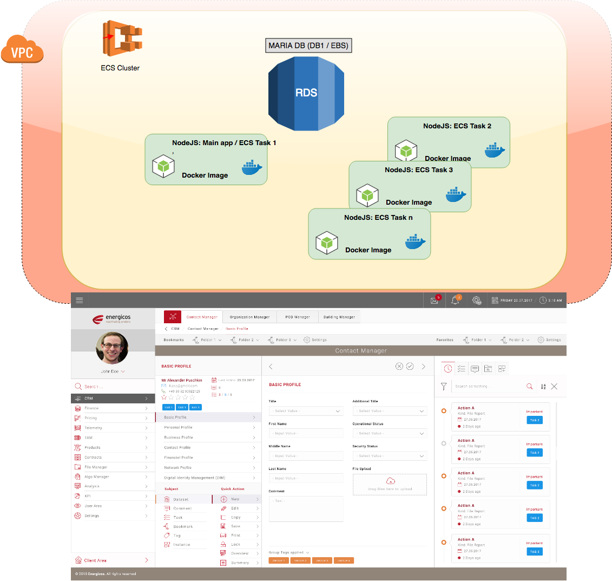
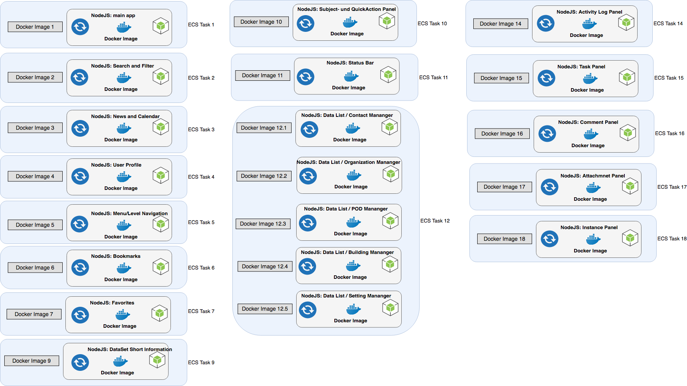

# EBS micro frontend concept

## A. Introduction

### 1. Objective - big picture

- The goal is a feasible concept for the creation of a microservice based app using the "MicroFrontEnd" approach for the given page structure, that
  - exclusively uses the prescribed technologies
  - names all components and techniques to be used and describes how they are to be used
  - fully describes how the components interact
  - contains a guide for creating a microservice based app with microfrontend approach
  - contains an executable example project on GitHub including all source code

### 2. Schematic representation of the Web App

Presentation of services in the AWS environment

Display of all services / tasks as Docker Image

Areas/modules in the front end using a list as an example

Areas/modules in the front end using the example of a basic profile

#### 2.1 Description

The page is split into separate components/fragments which represents the individual micoapps...

...more must be described here...

### 3. provided by us

* Source for the approach "microfrontends" (https://micro-frontends.org/)
* Design Mockup for the example use case
* Frontend as HTML/CSS Code for the example use case
* List with all resource and endpoints for the example use case

### 4. further References

Table with all references

- Link to Design Mockup
- Link to HTML/CSS Code
- Tabel with resources and endpoint

### 5. Technology Stack

the following technologies are mandatory and cannot be replaced by any other technology similar or not without our explicit approval:

* **Backend-Technologien**
  * Latest NodeJS LTS version
  * MariaDB 
    * all tables must be utf8mb4
  * Docker (current version)
  * Swagger
  * NodeJS, Express
* **Frontend-Technologies**
  * HTML5
  * CSS3/ CSS Grid (no Flexbox/ no preprocessor)
  * Vuejs/ Javascript 
* **NOTE:**
  * use `fetch()` api, not jquery or xhr!

## B. Details of the assignment 

### 1. Scope of delivery

#### 1.1.Content of the concept

| __Content__ | __Description__ |
| --- | --- |
| 1. Summary | A summary which describes the main points of the concept, the components used and the advantages of the procedure. |
| 2. Overview | A structured flowchart from which the components used as their interaction can be seen. |
| 3. Used components | A complete list of the components to be used and their setup |
| 4. Used techniques | Description of how certain components and techniques are used |
| 5. Example | A complete example including source code documentation |

#### 1.2. technical parameter/ scope conditions

##### 1.2.1 GitHub

The contractor stores his concept on GitHub in the project "EBS_microfrontend_concept" in a separate branch.
GitHub Link: https://github.com/energicos/EBS_microfrontend_concept

##### 1.2.2 Persistence

- It is not the task of the concept to show how data is stored in a data layer.
- therefore only arrays should be used as temporary storages in this example

##### 1.2.3 API Development with Swagger

- create an API using Swagger
- create the API documentation with Swagger
- itemize all routes used in the AṔI using Swagger Docu

##### 1.2.3 Compatibility 

- the Webapp must run in the following Browser: 
  - chromium browser (open source part of google chrome) >= version 61	
  - Firefox >= version 54

#### 1.3 Timeline

* Project Start: xx.11.2018
* the timeframe for the project is set to 1 weeks upon hiring the developer
* meaning the concept must be ready ==xx.11.18==