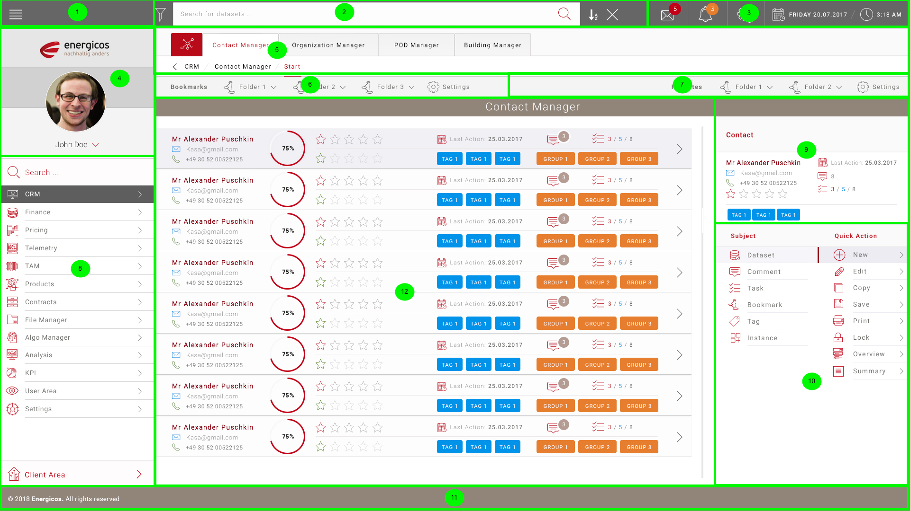
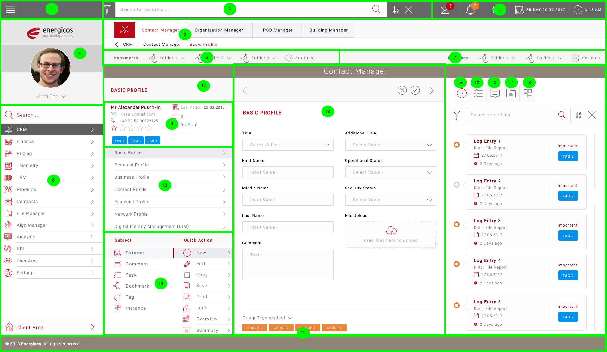

# EBS micro frontend concept

## A. Introduction

### 1. Objective - big picture

- The goal is a feasible concept for the creation of a microservice based app using the "MicroFrontEnd" approach for the given page structure, that
  - follows the approach on https://micro-frontends.org/
  - exclusively uses the prescribed technologies
  - names all components and techniques to be used and describes how they are to be used
  - fully describes how the components interact
  - contains a guide for creating a microservice based app with microfrontend approach.
  - contains an executable example project on GitHub including all source code. This example must show clearly how microservices will interact in order to satisfy the architecture proposed, how to share data between and how to comunicate between micro-front apps.

### 2. Schematic representation of the Web App

Presentation of services in the AWS environment

Display of all services / tasks as Docker Image

Areas/modules in the front end using a list as an example

Areas/modules in the front end using the example of a basic profile

#### 2.1 Description

The page is split into separate components/fragments which represents the individual micoapps...

There will be a master component which we called the shell, which orchestrates all the micro components that are going to be displayed inside the view.

Other components will be treated as children components. It will be a simple hierarchy of two layers: Master(Shell) + Children Components.

The components may share data between them and also some actions inside one component can produce an effect in other component, so we need to know how to do that.

We want to achieve a plug and play application in which we can add or remove components easily without affecting the application. Probably an API should be specified and it will define what actions or effects can be taken inside one component, and with a standardized API we can guarantee that nothing will break.

### 3. provided by us

* Source for the approach "microfrontends" (https://micro-frontends.org/)
* Another link with microfrontends concepts and resources (https://www.softwarearchitekt.at/post/2018/08/19/angular-react-vue-js-and-co-peacefully-united-thanks-to-micro-apps-and-web-components.aspx)
* Design Mockup for the example use case
* Frontend as HTML/CSS Code for the example use case
* List with all resource and endpoints for the example use case

### 4. further References

Table with all references

- Link to Design Mockup
- Link to HTML/CSS Code
- Table with resources and endpoints

### 5. Technology Stack

The following technologies are mandatory and cannot be replaced by any other technology similar or not without our explicit approval:

* **Backend-Technologies**
  * Latest NodeJS LTS version: 10
  * MariaDB
    * all tables must be utf8mb4
  * Docker (current version)
  * Swagger
  * Express
  * Create unit tests with Mocha and chai. You can also include test coverage with Istanbul.
* **Frontend-Technologies**
  * HTML5
  * CSS3 with Sass preprocessor. Use Grid Layout (no Flexbox)
  * Vuejs/ Javascript
  * Create e2e tests with Cypress
* **NOTE:**
  * use `fetch()` api, not jquery or xhr!
  * use typescript as a static checker for both backend and frontend
  * use webpack 4 to build the production assets

## B. Details of the assignment

### 1. Scope of delivery

#### 1.1.Content of the concept

| __Content__ | __Description__ |
| --- | --- |
| 1. Summary | A summary which describes the main points of the concept, the components used and the advantages of the procedure. |
| 2. Overview | A structured flowchart from which the components used as their interaction can be seen. |
| 3. Used components | A complete list of the components to be used and their setup |
| 4. Used techniques | Description of how certain components and techniques are used |
| 5. Example | A complete example including source code documentation |

#### 1.2. technical parameter/ scope conditions

##### 1.2.1 GitHub

The contractor stores his concept on GitHub in the project "EBS_microfrontend_concept" in a separate branch.
GitHub Link: https://github.com/energicos/EBS_microfrontend_concept

##### 1.2.2 Persistence

- It is not the task of the concept to show how data is stored in a data layer.
- therefore only arrays should be used as temporary storages in this example

##### 1.2.3 API Development with Swagger

- create an API using Swagger
- create the API documentation with Swagger
- itemize all routes used in the AṔI using Swagger Docu

##### 1.2.3 Compatibility

- the Webapp must run in the following Browser:
  - chromium browser (open source part of google chrome) >= version 61
  - Firefox >= version 54

#### 1.3 Timeline

* Project Start: xx.11.2018
* the timeframe for the project is set to 1 weeks upon hiring the developer
* meaning the concept must be ready ==xx.11.18==
